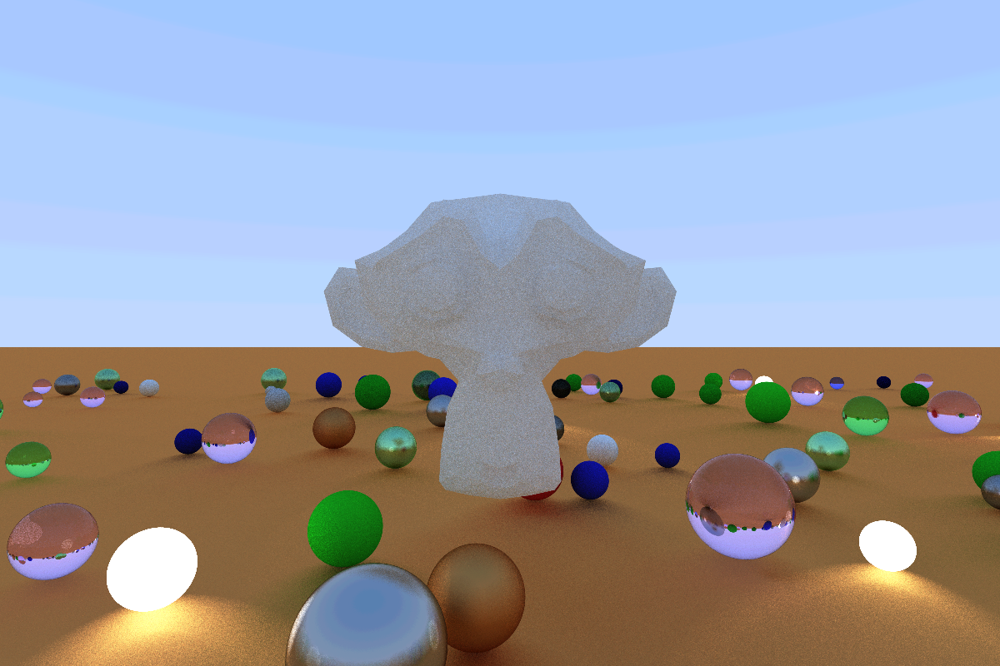

# raytracer.rs
An implementation of [Raytracing in one Weekend](https://raytracing.github.io/books/RayTracingInOneWeekend.html) written
in Rust and WGSL using [wgpu](https://wgpu.rs/) with a few extra features. 

## Pictures

## Shape Primitives
This renderer can render:
- Spheres
- Triangle Meshes which can be loaded from a Collada file

## Supported Materials
- Lambertian
- Metal
- Dielectric
- Emmissive